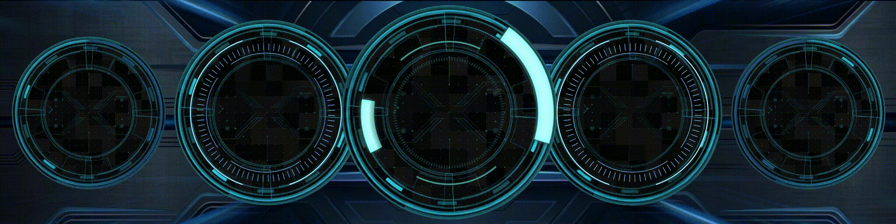

# Turzx-Blue-Technology-Animated
Theme for Turzx 8.8/9.2 inch screen

A customized theme for the **Turzx 8.8-inch (and 9.2/4.6 inch)** smart screens. This version enhances the official layout with animated elements for a more dynamic look.

## 📸 Preview

The theme shows CPU and GPU usage and Temps with current FPS. RivaTunerStatistics is needed to show fps. 

## 📥 Installation
1. [Download Blue Technology Theme](https://github.com/100fino/Turzx-Blue-Technology-Animated/raw/main/Blue%20Technology%20v5.turtheme)
2. Open ThemeEdit in TurzX software
3. Load theme.

## 📝 Credits & Attribution
This project is a modified version of official assets combined with community resources:

*   **Original Base Theme:** Provided by [Turzx Official](https://www.turzx.com/2025/05/26/88_inch/).
*   **Animated Elements:** Vector graphics and animations sourced from [Vecteezy.com](https://www.vecteezy.com/). 

## 📜 License
This theme is shared for **personal, non-commercial use only**. 
